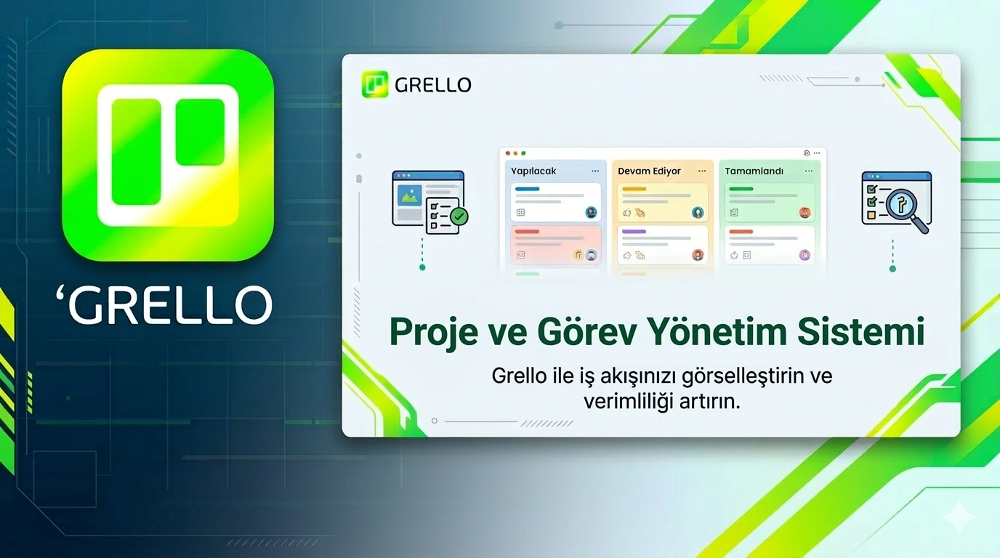

# Grello

---

## Proje Hakkında

**Proje Tanımı:** 

Grello, Kanban panoları temeline dayanarak kullanıcıların projeler oluşturup bu projeler altında görevler tanımlayabildiği bir görev ve proje yönetim sistemidir. Sistem kullanıcıların projeler oluşturmalarına, bu projelere görevler eklemelerine, görevlerin durumlarını takip etmelerine, güncellemelerine ve projeler üzerinde düzenli bir çalışma akışı oluşturmalarına yardımcı olur.

Grello, kullanıcıların görevlerini oluşturma, listeleme, düzenleme ve silme gibi temel işlemleri gerçekleştirebileceği bir altyapı sunar. Görevler farklı durumlara (örneğin yapılacak, devam ediyor, tamamlandı) atanabilir ve projeler içerisindeki işlerin ilerleme süreci görsel ve düzenli bir şekilde takip edilebilir. Bu sayede kullanıcılar üzerinde çalıştıkları projelerde hangi görevlerin tamamlandığını, hangilerinin devam ettiğini veya henüz başlanmadığını kolayca görebilir.

**Proje Kategorisi:** Proje ve görev yönetim sistemi / Task management application

**Referans Uygulama:** 
> [Örnek Referans Uygulama](https://trello.com/tr)

---

## Proje Linkleri

- **REST API Adresi:** [api.yazmuh.com](https://api.yazmuh.com)
- **Web Frontend Adresi:** [frontend.yazmuh.com](https://frontend.yazmuh.com)

---

## Proje Ekibi

**Grup Adı:** Specter

**Ekip Üyeleri:** 
- Aziz Can Durmaz

---

## Dokümantasyon

Proje dokümantasyonuna aşağıdaki linklerden erişebilirsiniz:

1. [Gereksinim Analizi](Gereksinim-Analizi.md)
2. [REST API Tasarımı](API-Tasarimi.md)
3. [REST API](Rest-API.md)
4. [Web Front-End](WebFrontEnd.md)
5. [Mobil Front-End](MobilFrontEnd.md)
6. [Mobil Backend](MobilBackEnd.md)
7. [Video Sunum](Sunum.md)

---